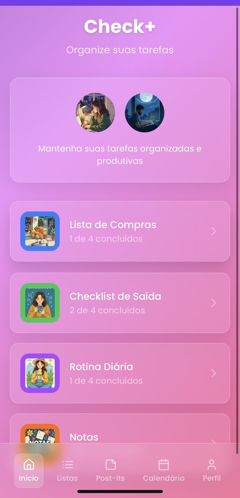
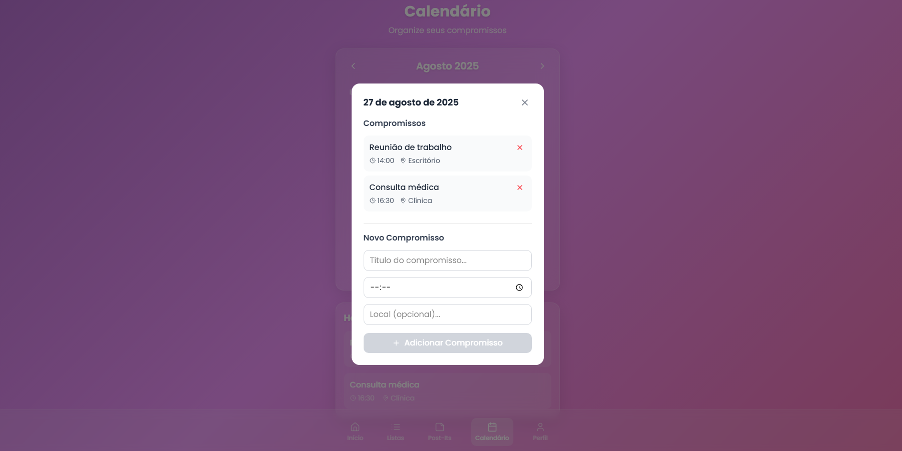
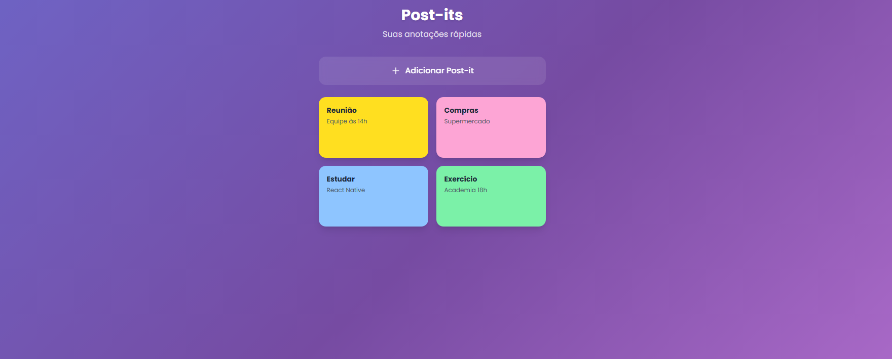
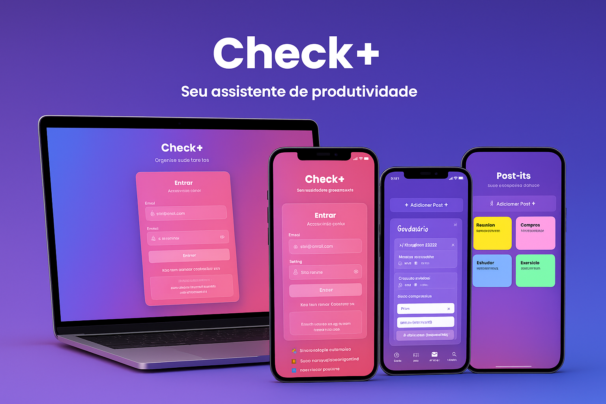

# ✅ Check+ — PWA de Organização Pessoal

**Check+** é um **Progressive Web App (PWA)** criado para ajudar na organização pessoal de forma simples e visualmente atrativa.  
O app combina **listas**, **checklists**, **post-its**, **rotinas** e **calendário** em um só lugar, com estética **lofi** relaxante, responsiva e instalável em qualquer celular ou desktop.  

🔗 **Acesse em produção:** [checkplus-pwa.vercel.app](https://checkplus-pwa.vercel.app)

---

## ✨ Principais funcionalidades

- ✅ **Minhas Listas** — listas temáticas (ex.: compras, estudo, casa).  
- 🏠 **Checklists** — itens com progresso visual.  
- 📝 **Post-its digitais** — notas rápidas coloridas, estilo bloco adesivo.  
- ☀️ **Rotina diária** — hábitos para marcar todos os dias.  
- 📅 **Calendário** — compromissos com horário e data.  
- 📱 **PWA completo** — instalável, funciona offline e responsivo.  
- 🎨 **Estética lofi** — gradientes suaves e design minimalista.  

---

## Capturas de tela

### Tela inicial

### Tela de login

### Calendário

### Post-its digitais

### Mockup promocional

---

## 🛠️ Tecnologias

- **Frontend:** HTML, CSS, JavaScript (SPA com Vite)  
- **PWA:** Manifest + Service Worker (funciona offline e instalável)  
- **Armazenamento:** LocalStorage (listas, post-its e rotinas salvos no dispositivo)  
- **Design:** imagens e ilustrações geradas via IA (prompts autorais)  

---
🗺️ Roadmap

🔔 Notificações locais de lembretes

📊 Gamificação (streaks e conquistas)

☁️ Backup em nuvem / sincronização

🤝 Compartilhar listas via link

🔍 Busca global entre listas/notas

--

📱 Instalar como App (PWA)

Desktop (Chrome/Edge): clique em Instalar App na barra de endereço.

Android (Chrome): Menu → Adicionar à Tela inicial.

iPhone (Safari): Compartilhar → Adicionar à Tela de Início.

🚀 Deploy (Vercel)

Deploy já disponível em produção:
👉 https://checkplus-pwa.vercel.app

Configurações da Vercel:

Framework: Vite

Build Command: npm run build

Output Directory: dist

Root Directory: check-plus-pwa

Cada git push na branch principal dispara um novo deploy automático.

👩‍💻 Autoria

Concepção e design: ideia original, UI/UX em estilo lofi e prompts de IA para imagens/ícones.

Desenvolvimento: estrutura do PWA, lógica de listas/post-its/rotinas, ajustes de UI e deploy.

Ferramentas de IA: usadas como aceleradoras de desenvolvimento, com direção de design e funcionalidades definida por mim.

📜 Licença

Este projeto está licenciado sob a MIT License.
Você pode estudar, usar e adaptar — mantendo os créditos à autora.

---

